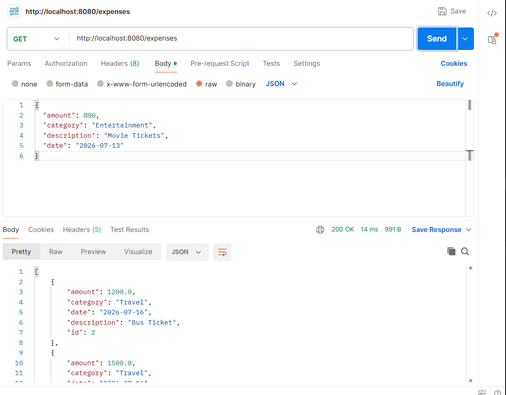
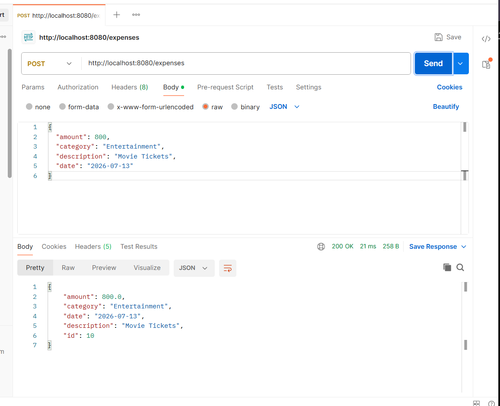
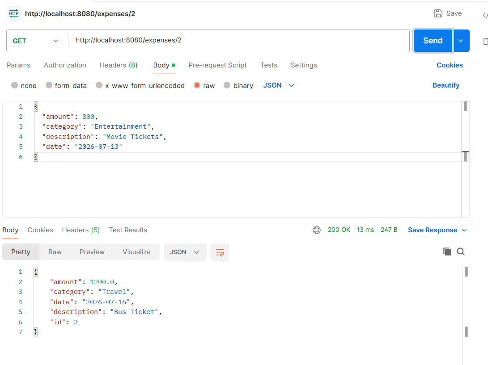
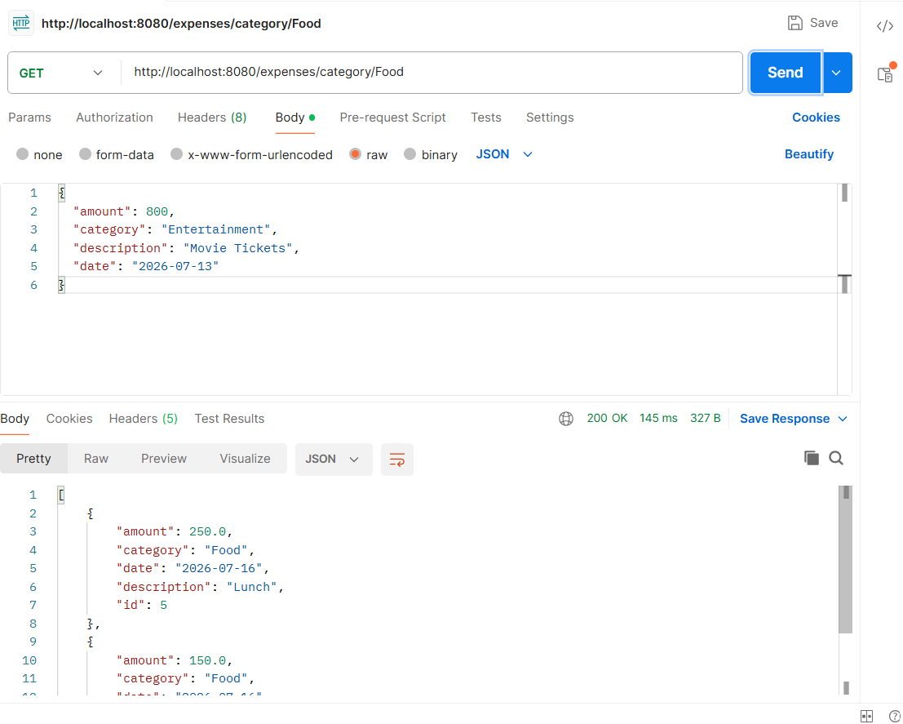
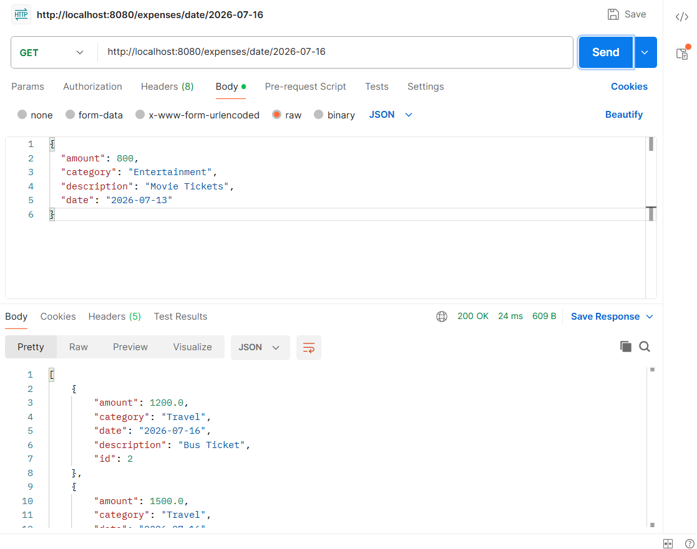
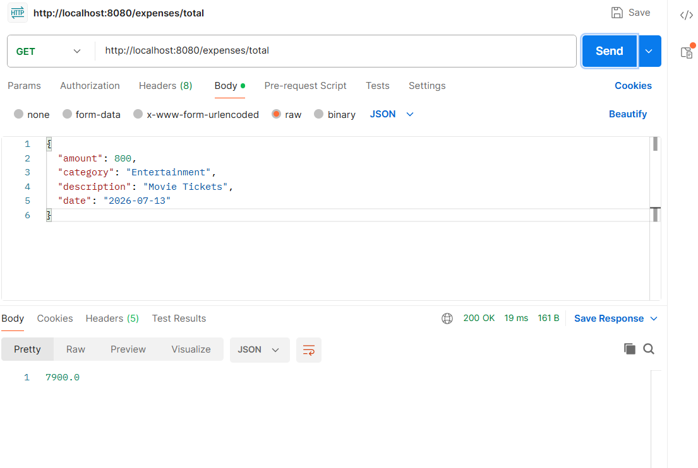
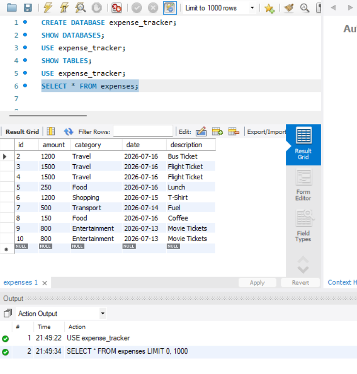

# Expense Tracker REST API

A RESTful backend application built with **Spring Boot**, **Spring Data JPA**, and **MySQL** for managing daily expenses. The application provides REST APIs to create, update, retrieve, search, and delete expense records while storing data in a MySQL database.

---

## Features

- Create a new expense
- View all expenses
- View an expense by ID
- Update an existing expense
- Delete an expense
- Search expenses by category
- Search expenses by date
- Calculate total expenses
- Global exception handling for invalid expense IDs

---

## Tech Stack

- Java 21
- Spring Boot
- Spring Data JPA
- Hibernate
- MySQL
- Maven
- Postman
- Git
- GitHub

---

## Project Structure

```text
src
└── main
    ├── java
    │   └── com
    │       └── addie
    │           └── expense_tracker
    │               ├── controller
    │               ├── entity
    │               ├── exception
    │               ├── repository
    │               ├── service
    │               └── ExpenseTrackerApplication.java
    └── resources
        └── application.properties
```

---

## API Endpoints

| Method | Endpoint | Description |
|--------|----------|-------------|
| POST | `/expenses` | Create a new expense |
| GET | `/expenses` | Retrieve all expenses |
| GET | `/expenses/{id}` | Retrieve an expense by ID |
| PUT | `/expenses/{id}` | Update an existing expense |
| DELETE | `/expenses/{id}` | Delete an expense |
| GET | `/expenses/category/{category}` | Search expenses by category |
| GET | `/expenses/date/{date}` | Search expenses by date |
| GET | `/expenses/total` | Calculate total expenses |

---

## Database

- MySQL Database
- Spring Data JPA
- Hibernate ORM

---

## Testing

All REST APIs were tested using Postman.

---

## Screenshots

### Get All Expenses


### Create Expense


### Get Expense by ID


### Search by Category


### Search by Date


### Total Expenses


### MySQL Workbench


---

## Future Improvements

- Input validation
- Swagger/OpenAPI documentation
- Pagination and sorting
- User authentication and authorization

---

## Author

**Aditi Maurya**

GitHub: [aditimauryawork-oss](https://github.com/aditimauryawork-oss)
